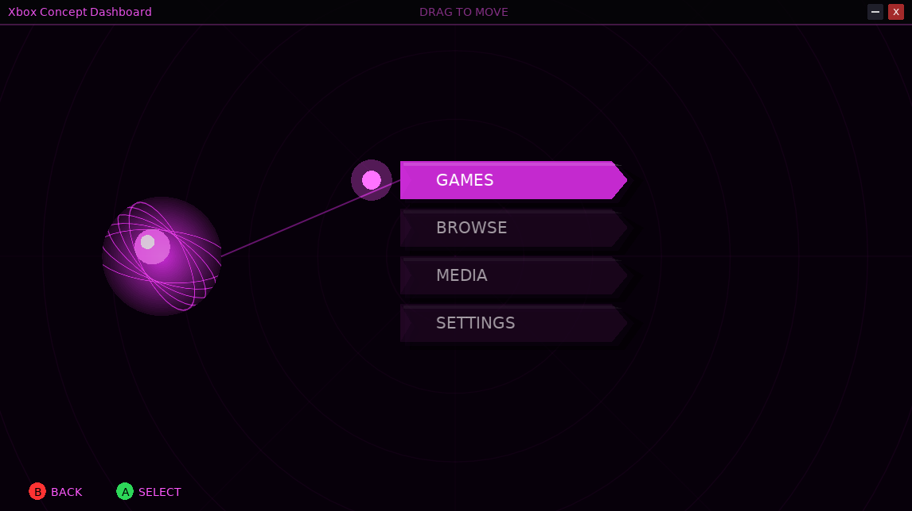

# Xbox Concept Dashboard (Love2D)

A retro-futuristic, Xbox-inspired **desktop launcher** built with **Love2D** (LÖVE). It features a custom frameless draggable window, a procedural glowing sphere wrapped in intersecting orbital wireframe rings, a multi-pass bloom shader, a radar grid background, hierarchical category menus with app icons, live color theme switching — and a real **Shortcut Manager + App Launcher** so you can add your own apps/websites and launch them straight from the dashboard.



---

## Features

* **Procedural Glowing Sphere & Orbital Rings** — A central planet body drawn with radial gradient layers, wrapped by intersecting rotating wireframe rings, and enhanced with a two-pass (separable) Gaussian blur bloom shader.
* **Radar Grid Background** — Concentric radar rings and crosshair spokes rendered on a dedicated canvas, tinted to the active theme.
* **Hierarchical Menu System** — Two-tier navigation: four top-level categories (**Games**, **Browse**, **Media**, **Settings**), each with icon sub-items.
* **Shortcut Manager (custom apps)** — Add your own shortcuts via the in-app wizard (`Settings → + Add Shortcut…`). Each shortcut is a local app path *or* a website, filed under Games/Browse/Media, and persisted to `config.json`. Remove or reorder them any time.
* **App Launcher** — Launches real programs, not just URLs: `.exe`/`.bat` paths are spawned detached (Windows `start`, macOS `open`, Linux `setsid`) so they keep running after the launcher exits; websites open in your default browser. This is what bridges the gap between a Wallpaper Engine-style dashboard and a package manager.
* **Dynamic Color Themes** — Four built-in profiles (**Green**, **Blue**, **Red**, **Purple**); cycle with **Left/Right** inside Settings or select the *Theme* item. Theme changes apply live across background, sphere, rings, menu, and title bar.
* **Configurable Window System** — Resolution presets (720p→1440p), Borderless / Windowed / Fullscreen modes, UI scale (75–150%), all persisted and applied live.
* **Draggable Frameless Window** — Custom title bar with working minimize (–) and close (×); click-and-drag repositioning clamped to screen bounds; position remembered between sessions.
* **Graceful Degradation** — Missing icon files are skipped silently (`pcall` loading), so the launcher still runs without the `icons/` folder.

---

## Controls

| Key / Action | Description |
| :--- | :--- |
| **Up / Down** | Navigate menu items up and down |
| **A / Enter / Keypad Enter** | Select item, open category, or launch app/URL |
| **B / Escape** | Go back one level (at the main menu it does nothing — only × quits) |
| **Left / Right** | Cycle the highlighted Settings option (theme/resolution/window/scale) |
| **Mouse Drag** | Click and drag to move the window |
| **Mouse Click (top-right)** | Minimize (–) or close (×) the window |

### Add-Shortcut Wizard

Open with `Settings → + Add Shortcut…` (or click it). While the wizard is open:

| Key / Action | Description |
| :--- | :--- |
| **Up / Down** | Move between fields (Name, Type, Target, Category) |
| **Left / Right** | Cycle *Type* (App/Website) and *Category* (Games/Browse/Media) |
| **A** | Toggle free-text entry on the *Name* / *Target* field, then type |
| **Enter** | Create the shortcut and return to the menu |
| **B / Escape** | Cancel |

---

## Project Structure

```
Xbox_Launcher/
├── conf.lua      — LÖVE window/config bootstrap
├── main.lua      — Thin LÖVE bootstrap: wires love.* callbacks to core/ modules
├── core/         — All application logic (modular)
│   ├── config.lua     — persistent settings (userdata/config.json)
│   ├── state.lua      — shared runtime state (single source of truth)
│   ├── themes.lua     — color theme profiles
│   ├── menu_data.lua  — built-in category/item tree + icons
│   ├── shortcuts.lua  — Shortcut Manager: add/remove/reorder user apps
│   ├── launcher.lua   — App Launcher: spawn local programs / open URLs
│   ├── wizard.lua     — in-app "Add Shortcut" form
│   ├── settings.lua   — resolution / window-mode / scale actions
│   ├── layout.lua     — responsive geometry + hit-test helpers
│   ├── menu.lua       — navigation state machine (keyboard & mouse paths)
│   ├── render.lua     — all drawing: radar bg, planet, bloom, title bar, menu
│   └── json.lua       — dependency-free JSON encoder/decoder
├── icons/        — App/platform icons loaded by the menu
├── shaders/      — .glsl shaders (bloom blur, orbital rings)
├── arial.ttf     — Font asset
└── Screenshot_6_07PM_8_24_2026.png — Hero screenshot
```

---

## Requirements

* **LÖVE (Love2D) 11.x** — tested against 11.5 (the current stable release). Download from [love2d.org](https://love2d.org/).
* **OS:** Windows, macOS, or Linux (LÖVE is cross-platform; the App Launcher uses each OS's native spawn mechanism).
* No external dependencies or packages required — pure LÖVE + built-in graphics/shaders.

---

## How to Run

1. Install [LÖVE 11.5](https://love2d.org/download/).
2. Run the project from the project root:

   ```bash
   love .
   ```

   Or double-click a packaged `.love` archive, or open the folder in LÖVE's app launcher.

3. Navigate with the keyboard or mouse, and click the top bar to drag the window.

> **Note:** The menu icons in `icons/` are loaded by name. Any missing icon is skipped silently — the launcher works fine without them. Your custom shortcuts and settings persist in `userdata/config.json`.

---

## Building a Distributable

To package as a single `.love` file for distribution:

```bash
love pack .
```

This produces a portable `Xbox_Launcher.love` that runs on any OS with LÖVE installed — ideal for the planned [itch.io](https://itch.io/) release.

---

## Roadmap

See [goals.md](goals.md) for the full feature roadmap. Completed so far: **Config System**, **Shortcut Manager**, **App Launcher**, **Wizard UI**, **Settings Expansion** (resolution/fullscreen/scale), and the **Module Refactor**. Next up:

* **Gamepad Support** — full `love.joystick` binding (Xbox layout) for a true couch/console feel.
* **Icon Picker / Auto-extract** — browse for a PNG or auto-extract an icon from a `.exe`.
* **Performance** — batch the static radar background to a single texture, pre-bake bloom passes, and reduce per-frame canvas clears.

---

## License

This project is provided as a prototype for personal and educational use. See [goals.md](goals.md) for distribution and monetization plans (targeting itch.io / Steam as a free or paid utility).

Love2d 11.5 version theres no version after